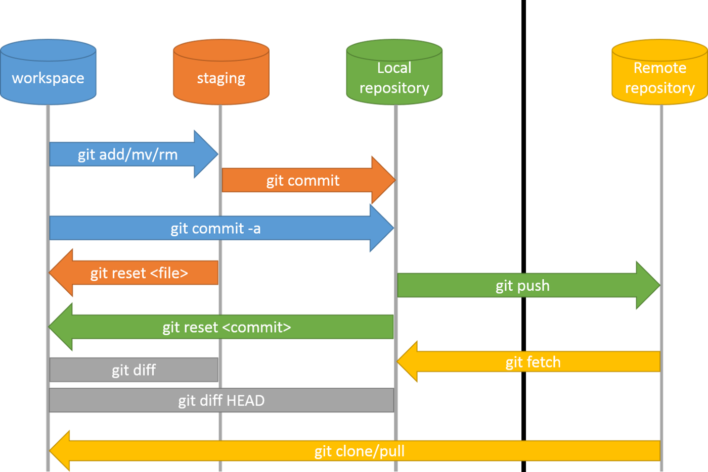

# Fast API and pandas

## Why

The technical solution of "Fast API" will be demonstrated. The API will runs with
> uvicorn main:app --reload
in the local environment

 in a cloud environment and in interaction with Python/Pandas data types. The use of a container-based architecture is preferred as the solution should be modular and scalable. The architecture is sketched for better understanding

Since we deploy and commit, the following understanding of Git is crucial:

Remarks: Deployment in AZURE as WebApp possible

## How we do it

## Docker

* [FastAPI in Containers - Docker](https://fastapi.tiangolo.com/deployment/docker/)

## Fast API

* [FastAPI Tutorial - Building RESTful APIs with Python](https://www.youtube.com/watch?v=GN6ICac3OXY)

## Rest Testing

* [Thunder Client](https://www.thunderclient.com/)

